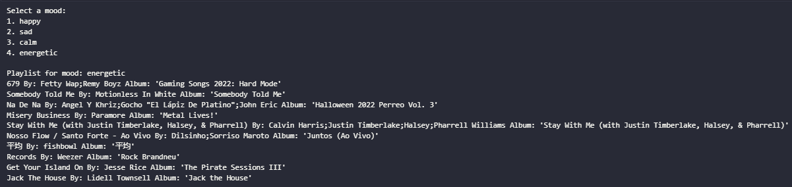

# 480 Semester Project: Mood.fm

*AI-generated image created using Bing Image Creator on 10-28-2024.*

---

## Table of Contents
1. [Members](#members)
2. [Project Overview](#project-overview)
   * [Why Mood.fm?](#why-moodfm)
   * [Goal](#goal)
   * [Challenges and Adaptations](#challenges-and-adaptations)
3. [Project Directory](#project-directory)
4. [Getting Started](#getting-started)
   * [Prerequisites](#prerequisites)
5. [Project Structure](#project-structure)
6. [Steps to Run the Project](#steps-to-run-the-project)
   * [Step 1: Clone the Repository](#step-1-clone-the-repository-to-your-local-machine)
   * [Step 2: Preprocess the Data (Optional)](#step-2-preprocess-the-data-optional)
   * [Step 3: Train the Neural Network (Optional)](#step-3-train-the-neural-network-optional)
   * [Step 4: Test and Evaluate the Model](#step-4-test-and-evaluate-the-model)
   * [Step 5: Generate Playlists](#step-5-generate-playlists)
7. [Analysis and Model Details](#analysis-and-model-details)
   * [Dataset and Preprocessing](#dataset-and-preprocessing)
   * [Neural Network Architecture](#neural-network-architecture)
   * [Training Process](#training-process)
8. [Future Considerations](#future-considerations)
9. [References/Acknowledgments](#referencesacknowledgments)

---

# Members:
* Carolina Mancina
* Madelyn Smith
* Taylor Peterson

---

## Project Overview
We aim to create a website that generates playlists of recommended songs based on the user's current mood, genres, and/or favorite artists. Our goal is to outperform platforms like Spotify or YouTube Music by curating better recommendations, especially for discovering new songs.

### Why Mood.fm?
Spotify typically recommends songs based only on what users have listened to or liked, rarely introducing new music. Mood.fm seeks to improve upon this by leveraging moods and user input to create more personalized recommendations.

### Goal:
1. **Playlist Recommendations**: Curated by mood, genre, or favorite artist.
2. **Rating System**: Allows users to rate songs on a 5-star scale.
3. **Mood Tracking**: Users can provide feedback on their mood after listening to songs, genres, or albums to further refine recommendations.

### Challenges and Adaptations:
- Initially, we incorporated Spotify's Web API to fetch real-time music data. Unfortunately, due to recent changes in Spotify's API accessibility ([announcement](https://developer.spotify.com/blog/2024-11-27-changes-to-the-web-api), [The Verge](https://www.theverge.com/2024/12/5/24311523/spotify-locked-down-apis-developers)), we shifted to using the Kaggle dataset instead.

---

## Project Directory:
* **`.vscode`**: Some needed materials for Visual Studio
* **`AllMoodPlaylist`**: This folder should be in the "Progress" folderm but is too large to be officially placed there.
* **`NewData/notebooks`**: Our **final** working program. Run **this** one!
* **`Progress`**: Contains all of the files we had worked on in the semester
* **`README.md`**: You are here!

---

## Getting Started

### Prerequisites:
1. **Python Environment**: Ensure Python 3.8 or higher is installed
2. **Required Libraries**:
   * `numpy`
   * `pandas`
   * `scikit-learn`
   * `seaborn`
   * `torch`
   * `torchvision`
   * `tqdm`

---

## Project Structure

The project directory includes the following:
* NewData/notebooks/: Main project folder containing all resources and scripts
   * `data_preprocessing.ipynb`: Notebook for cleaning and preprocessing the dataset
   * `features_dataset.csv`: Dataset with extracted features for training the model.
   * `metadata_dataset.csv`; Metadata associated with the dataset
   * `mood_prediction_model.pth`: Pre-trained neural network model for mood classification.
   * `NN.ipynb`: Notebook for training the neural network.
   * `testing_model.ipynb`: Notebook for testing and evaluating the model.
   * `resources/dataset.csv`: Original raw dataset from Kaggle.
 
## Steps to Run the Project

---

### Step 1: Clone the repository to your local machine

### Step 2: Preprocess the Data (Optional)
  1. Open the `data_preprocessing.ipynb` notebook in Jupyter Notebook, VSCode or any compatible IDE.
  2. Run each cell to:
      * Clean the raw dataset (`resources/dataset.csv`).
      * Generate:
         * `features_dataset.csv`: Extracted features, saved in the `notebooks` directory.
         * `metadata_dataset.csv`: Metadata for future analysis, saved in the same directory.

***Note**: This step is optional as these files already exist.*

---

### Step 3: Train the Neural Network (Optional)
   1. Open `NN.ipynb`.
   2. Run all cells to train the neural network using `features_dataset.csv`.
     * This will overwrite `mood_prediction_model.pth` with a newly trained model.
   3. The training process:
      * Uses extracted features as input to the model.
---

### Step 4: Test and Evaluate the Model
   1. Open `testing_model.ipynb`.
   2. Run all cells to
      * Load the pre-trained model `mood_prediction_model.pth`.
      * Evaluate the model on test data from `features_dataset.csv`.
   3. Generated Outputs:
      * Classification Report: Displays model performance metrics (precision, recall, F1-score, etc.).
      * Confusion Matrices: Matrix visualizing the model's predictions vs. actual labels
      * Accuracy and Loss graphs: Plots tracking the model's training/testing performance
     
---

### Step 5: Generate Playlists
1. Run the Playlist Generation Function:
   * Open `testing_model.ipynb`.
   * Locate the playlist generation function near the end of the notebook.
   * Execute the cells to load the model `mood_prediction_model.pth` and prepare the dataset `features_dataset.csv`.
2. How the function works:
   * The function uses the **`predicted_mood column`** from the dataset to group songs into predefined mood categories:
       * `1`: Happy
       * `2`: Sad
       * `3`: Calm
       * `4`: Energetic
   * When prompted, the user selects a mood by entering the corresponding number (ex. `1` for `happy`)
3. After Selection:
   * The function filters songs in the dataset based on the selected mood
   * From the filtered songs, a subset is randomly selected to form the playlist
   * Each song in the playlist is displayed with the following details:
      * **Track Name**: The name of the song.
      * **Artists**: The song's artist(s).
      * **Album Name**: The album the song belongs to.
4. Example User Interaction:

### Additional Notes:
* Randomization ensures that each time a playlist is generated, the results are varied, even for the same mood category.
* Ensure the dataset and required models are properly loaded before running the playlist generation function to avoid errors.

## Analysis and Model Details

### Dataset and Preprocessing
* **Dataset**: Sourced from Kaggle with 114,000 Spotify tracks.
* **Features**: Key attributes such as valence, energy, tempo, danceablity, and more were used to classify moods.
* **Preprocessing**:
  1. Selected relevant features required for mood classification.
  2. Encoded mood labels numerically
  3. Created mood labels using thresholds (e.g. valence > 0.5 = happy)
  4. Scaled features to improve neural network performance.
  5. Saved preprocessed data into `features_dataset.csv` for training and `metadata_dataset.csv` for analysis.

---

### Neural Network Architecture:
* **Input Layer**: 12 features
* **Hidden Layers**:
    * First Layer: 64 neurons, ReLU activation.
    * Second Layer: 32 neurons, ReLU activation
* **Output Layer**: 4 neurons, representing the four mood categories (Happy, Sad, Calm, Energetic)

---

### Training Process
1. **Forward Pass**:
   * Input: Feature vector from the dataset (e.g., valence, tempo).
   * Output: Predicted probabilities for each mood category.
2. **Loss Calculation**:
   * Used CrossEntropyLoss to calculate the error between predicted and actual moods.
3. **Backpropagation**:
   * Calculated gradients to adjust the weights of the network.
   * Optimized using Adam optimizer.
4. **Training and Tetsing**:
   * Split: 80% training, 20% testing.
   * Achieved a test accuracy of **98.68%**.

---

## Future Considerations
  * **Save Playlist**: Modify the function to save the generated playlist as a .csv file for future use
  * **Playlist Length**: Customize the number of songs in the playlist by modifying the random selection logic.

# References/Acknowledgments:

Link to our [GoogleDrive](https://drive.google.com/file/d/1asQ54xgKQVuRjvSKScjQSjFgfoTC6d3k/view?usp=drivesdk). Google Drive has been shared with the professor.

1. [OpenAI. Chatgpt](https://chatgpt.com/?model=gpt-4o-mini): Assisted with documentation and code generation/formatting.

2. [Spotify Web API](https://developer.spotify.com/documentation/web-api): Previously used before API access was limited.

3. [Spotify Tracks Dataset](https://www.kaggle.com/datasets/maharshipandya/-spotify-tracks-dataset): Kaggle Dataset

4. [AI Playlist Expanding (Spotify Newsroom)](https://newsroom.spotify.com/2024-09-24/ai-playlist-expanding-usa-canada-ireland-new-zealand/): **Note**: While we were working on Mood.fm, Spotify began rolling out their AI-generated playlist recommendations in September 2024, aiming for a similar goal.

5. [Automatic Music Playlist Generation via Simulation-Based Reinforcement Learning](https://research.atspotify.com/2023/07/automatic-music-playlist-generation-via-simulation-based-reinforcement-learning/): Spotify Research, July 2023.  

6. [How Spotify Uses ML to Create the Future of Personalization](https://engineering.atspotify.com/2021/12/how-spotify-uses-ml-to-create-the-future-of-personalization/): Spotify Engineering, December 2021.  

7. [Shifting Consumption Towards Diverse Content via Reinforcement Learning](https://research.atspotify.com/2021/03/shifting-consumption-towards-diverse-content-via-reinforcement-learning/): Spotify Research, March 2021.  

8. [Socially Motivated Music Recommendation](https://research.atspotify.com/2024/06/socially-motivated-music-recommendation/): Spotify Research, June 2024.  

9. [Socially Motivated Music Recommendation (Publication)](https://research.atspotify.com/publications/socially-motivated-music-recommendation/): Spotify Research.  

10. [GNN-in-RS (GitHub Repository)](https://github.com/wusw14/GNN-in-RS): A GitHub repository for Graph Neural Networks in Recommendation Systems.  

11. [Global Music Streaming Data Reveals Robust Diurnal and Seasonal Patterns of Affective Preference](https://research.atspotify.com/publications/global-music-streaming-data-reveals-robust-diurnal-and-seasonal-patterns-of-affective-preference/): Spotify Research.  

12. [Shifting Affective Preferences and Patterns](https://dl.acm.org/doi/full/10.1145/3535101): ACM Digital Library.  

13. [Robust Diurnal and Seasonal Patterns of Affective Preference](https://www.nature.com/articles/s41562-018-0508-z?proof=true): Nature Publication.  

14. [Deam](https://www.kaggle.com/datasets/imsparsh/deam-mediaeval-dataset-emotional-analysis-in-music): MediaEval Database for Emotional Analysis 2017. Used in consideration of other datasets, later discarded.

15. [Spotify Deep Learning (GitHub Repository)](https://github.com/ieeecs-ut/spotify-deep-learning): A GitHub repository for deep learning projects related to Spotify.  

16. [Humans & Machines: A Look Behind Spotify's Algotorial Playlists](https://engineering.atspotify.com/2023/04/humans-machines-a-look-behind-spotifys-algotorial-playlists/): Spotify Engineering, April 2023.  

17. [ICWSM Article on Music and Mood Analysis](https://ojs.aaai.org/index.php/ICWSM/article/view/31359): AAAI Conference on Web and Social Media.  

18. [Spotify Research](https://research.atspotify.com/): Spotify's main research page.  

19. [Spotify Engineering](https://engineering.atspotify.com/): Spotify's engineering blog.  

20. [Spotify Developer Documentation](https://developer.spotify.com/): Main developer documentation.  

21. [Audio Features Endpoint](https://developer.spotify.com/documentation/web-api/reference/#endpoint-get-audio-features): Spotify Web API reference for audio features.  

22. [Spotify Accessibility Guidelines](https://developer.spotify.com/documentation/accessibility): Accessibility documentation for Spotify developers.  

23. [Spotify Design Guidelines](https://developer.spotify.com/documentation/design): Design guidelines for Spotify's developer tools.

